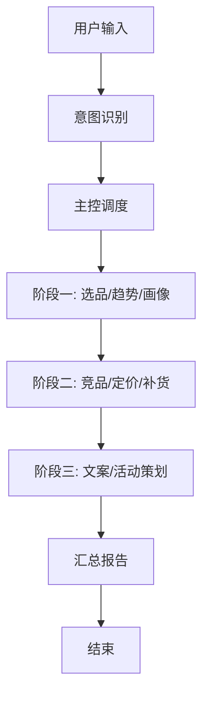

# 电商选品运营多智能体系统

基于 **LangGraph** + **FastAPI** + **Vue 3** 的多智能体协作平台。

让用户说一句话（如"帮我分析数码类目，推荐3个爆款"），系统内的 **10 个智能体**像真正的运营团队一样分工协作――理解需求、分析数据、预测趋势、写文案、做方案――最后汇总成一份报告。

---

## 技术栈

| 层面 | 选型 | 用途 |
|------|------|------|
| 智能体框架 | 自研 StateGraph 兼容层（ackend/app/graph/langgraph_compat.py） | 编排 10 个智能体的协作流程，不依赖外部 langgraph 包 |
| 后端 API | FastAPI（Python 3.9+） | REST 接口，供前端调用 |
| 前端 | Vue 3 + Vite + Pinia + ECharts | 交互式数据看板 |
| 数据库 | SQLite（开发）/ PostgreSQL（生产） | 结构化数据存储 |
| ORM | SQLAlchemy | 数据库操作 |
| 大模型 | MiniMax M3 | 自然语言理解与生成 |

---

## 系统架构

### 四层智能体体系

| 层级 | 智能体 | 职责 |
|------|--------|------|
| **意图层** | Agent 0: 意图识别 | 听懂用户自然语言，解析为结构化任务 |
| **编排层** | Agent 1: 主控编排 | 拆解任务、调度执行、汇总报告 |
| **分析层** | Agent 2: 选品分析 | 爆款指数计算、排名、价格分布 |
| | Agent 3: 趋势预测 | 多算法融合预测（线性回归 + 移动平均 + 指数平滑） |
| | Agent 4: 竞品分析 | 竞品识别、竞争力评估 |
| | Agent 5: 用户画像 | 用户标签体系、偏好分析 |
| **决策层** | Agent 6: 定价策略 | 最优定价、利润测算 |
| | Agent 7: 营销文案 | 商品文案生成、质量检查 |
| | Agent 8: 补货/清仓 | 安全库存、补货建议、清仓判断 |
| | Agent 9: 活动策划 | 促销方案设计、效果预估 |

### 任务流转流程

```
用户输入 → Intent Recognizer(意图识别)
    ↓ 结构化任务描述
Orchestrator(主控编排) → 阶段一：选品 + 趋势 + 画像（并行）
    ↓ 分析结果
阶段二：竞品 + 定价 + 补货（并行，依赖阶段一结果）
    ↓ 决策数据
阶段三：文案 + 活动策划（并行，依赖阶段二结果）
    ↓ 最终输出
主控汇总报告 → 用户
```

### LangGraph 工作流



---

## 快速启动

### 前置要求

- Python 3.9+
- Node.js 18+（前端）
- MiniMax API 密钥（[申请地址](https://platform.minimaxi.com)）

### 1. 后端启动

```powershell
# 进入后端目录
cd backend

# 配置环境变量
copy .env.example .env
# 编辑 .env 填入 MINIMAX_API_KEY

# 启动后端服务（端口 8085）
$env:PYTHONPATH = "D:\电商选品2\backend\lib"
python -m uvicorn app.main:app --reload --port 8085
```

### 2. 前端启动

```powershell
# 新终端
cd frontend

# 安装依赖
npm install

# 启动开发服务器（端口 5173）
npm run dev
```

### 3. 验证服务

打开浏览器访问：
- 后端接口: http://localhost:8085/ （应返回 `{"status":"ok"}`）
- 健康检查: http://localhost:8085/health
- 前端页面: http://localhost:5173/

---

## API 文档

### 基础接口

| 方法 | 路径 | 说明 |
|------|------|------|
| GET | `/` | 服务状态 |
| GET | `/health` | 健康检查 |

### Agent 独立 API（8 个端点）

| 方法 | 路径 | 说明 |
|------|------|------|
| POST | `/api/v1/intent/recognize` | 意图识别 |
| POST | `/api/v1/selection/analyze` | 选品分析 |
| POST | `/api/v1/trend/forecast` | 趋势预测 |
| POST | `/api/v1/competitor/analyze` | 竞品分析 |
| POST | `/api/v1/profile/analyze` | 用户画像 |
| POST | `/api/v1/pricing/analyze` | 定价策略 |
| POST | `/api/v1/copy/generate` | 营销文案 |
| POST | `/api/v1/inventory/analyze` | 补货/清仓建议 |
| POST | `/api/v1/promotion/plan` | 活动策划 |

### 编排 API

| 方法 | 路径 | 说明 |
|------|------|------|
| POST | `/api/v1/chat` | 全链路编排（从意图到报告） |
| POST | `/api/v1/langgraph/run` | LangGraph 工作流执行 |

### 测试示例

```powershell
# 意图识别
curl http://localhost:8085/api/v1/intent/recognize ^
  -H "Content-Type: application/json" ^
  -d "{""user_message"":""帮我分析数码类目，推荐3个爆款""}"

# 全链路编排
curl http://localhost:8085/api/v1/chat ^
  -H "Content-Type: application/json" ^
  -d "{""user_message"":""帮我分析数码类目，推荐3个爆款"",""session_id"":""test"",""turn_number"":1}"
```

---

## 项目结构

```
D:\电商选品2\
├── backend\
│   ├── app\
│   │   ├── main.py               # FastAPI 应用入口
│   │   ├── config.py             # 配置管理
│   │   ├── database.py           # 数据库初始化
│   │   │
│   │   ├── agents\
│   │   │   ├── __init__.py       # 智能体注册中心
│   │   │   ├── agent_00_intent_recognizer/    # 意图识别
│   │   │   ├── agent_01_orchestrator/         # 主控编排
│   │   │   ├── agent_02_product_selection/    # 选品分析
│   │   │   ├── agent_03_trend_forecast/       # 趋势预测
│   │   │   ├── agent_04_competitor_analysis/  # 竞品分析
│   │   │   ├── agent_05_user_profile/         # 用户画像
│   │   │   ├── agent_06_pricing_strategy/     # 定价策略
│   │   │   ├── agent_07_marketing_copy/       # 营销文案
│   │   │   ├── agent_08_inventory_advice/     # 补货/清仓
│   │   │   └── agent_09_promotion_plan/       # 活动策划
│   │   │
│   │   ├── api/                  # API 路由
│   │   ├── schemas/              # 数据模型
│   │   ├── services/             # 数据生成与飞书集成
│   │   └── utils/                # LLM 客户端等工具
│   │
│   └── requirements.txt
│
├── frontend\
│   ├── src\
│   │   ├── views/                # 10 个页面组件
│   │   ├── api/index.js          # API 封装
│   │   └── App.vue               # 应用入口
│   └── package.json
│
├── README.md                     # 本文件
└── .env                          # 环境变量配置
```

---

## 测试

```powershell
# 运行全量测试（自动启动/关闭服务）
python _full_test_v4.py

# 运行 A2 修复专项测试
python _test_fix_A2.py
```

全量测试覆盖 5 大板块：
1. 基础接口（2 项）
2. 意图识别（7 场景）
3. Agent 独立 API（8 端点）
4. 编排场景（4 场景）
5. LangGraph 工作流（2 场景）

---

## 开发状态

| 板块 | 状态 | 说明 |
|------|:----:|------|
| 10 个 Agent 代码 | ? 完成 | 全部实现并注册 |
| 后端 14 个路由 | ? 完成 | 全部注册并通过测试 |
| LangGraph 编排 | ? 完成 | 纯 Python 兼容层，3 阶段流程 |
| 前端 10 个页面 | ? 完成 | 含 ECharts 图表展示 |
| 编排核心 Bug 修复 | ? 完成 | top_n=None / product_id=0 / 依赖排序 |
| 全量测试 | ? 43/43 通过 | 覆盖编排/Agent/限流/日志/数据流 |
| 请求限流 | ? 完成 | 令牌桶，30次/60秒/IP |
| 日志轮转 | ? 完成 | RotatingFileHandler，10MB x 5 |
| 类目对齐 | ? 完成 | 中文标准类目 + 英文别名归一化 |
| 模拟数据 | ? 基础版 | 覆盖 5 个类目的 demo 数据 |
| 飞书集成 | ?? 代码就绪 | 沙箱环境无法验证，需真实凭据 |
| 前端端到端联调 | ? 待验证 | 需前后端配合调试 |

---

## 数据说明

系统内置了 5 个类目的模拟数据（食品、服饰、家居、数码、园艺、宠物用品、文具、箱包），每个类目含 20 个商品的完整信息（价格、评分、销量、库存等）。启动后端后数据自动初始化。

如需对接真实数据源，可按需修改 `backend/app/services/data_generator.py` 或替换为飞书 Bitable 数据。

---

## 关于 LangGraph 兼容层

本项目未直接依赖 `langgraph` 包，而是实现了纯 Python 的 `StateGraph` 兼容层（`backend/app/graph/langgraph_compat.py`），支持：

- `add_node()` / `add_edge()` / `add_conditional_edges()`
- `set_entry_point()` / `set_finish_point()`
- `compile()` / `invoke()`

无需安装额外依赖，开箱即用。
